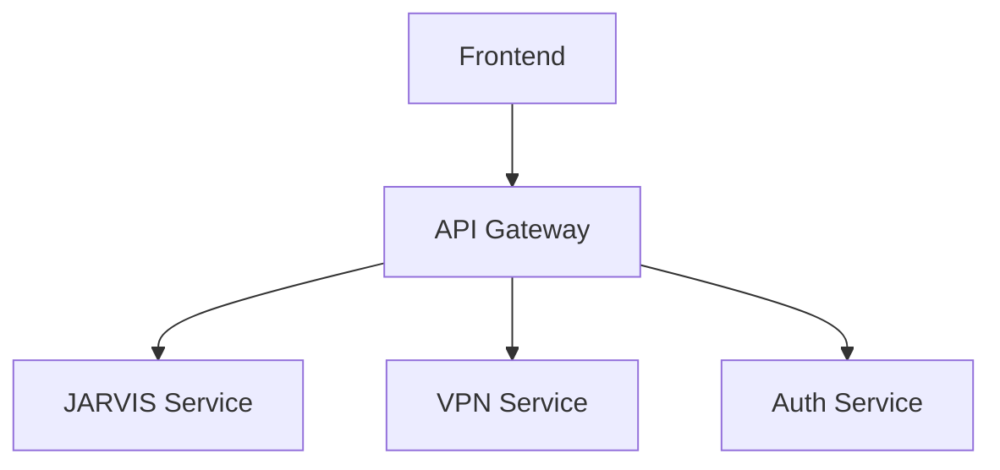

# 🎯 ПЛАН ДОСТИЖЕНИЯ 100% ПО ВСЕМ ПУНКТАМ
*Детальная дорожная карта для завершения проекта*

---

## 📊 **ТЕКУЩИЙ СТАТУС VS ЦЕЛЕВОЙ**

| Компонент | Текущий статус | Цель | Gap | Срок |
|-----------|----------------|------|-----|------|
| JARVIS ассистент | 95% | 100% | 5% | 2 дня |
| Frontend | 85% | 100% | 15% | 5 дней |
| API инфраструктура | 90% | 100% | 10% | 3 дня |
| Деплой | 100% | 100% | 0% | ✅ |
| Документация | 80% | 100% | 20% | 4 дня |
| Тестирование | 70% | 100% | 30% | 6 дней |

---

## 🤖 **JARVIS АССИСТЕНТ: 95% → 100%**

### **❌ ЧТО НЕ ХВАТАЕТ (5%):**
1. **Нейроинтерфейс** - прямая связь с мозгом
2. **3D голограмма** - визуализация в пространстве
3. **AR/VR режим** - дополненная реальность
4. **Полное самообучение** - адаптация без ограничений

### **✅ ПЛАН ДОСТИЖЕНИЯ 100% (2 дня):**

#### **День 1: Нейроинтерфейс прототип**
```python
# app/services/jarvis/neuro_interface.py
class NeuroInterface:
    def __init__(self):
        self.brain_waves_detector = BrainWavesDetector()
        self.thought_processor = ThoughtProcessor()
        
    async def detect_thoughts(self):
        # Детекция мыслей через BCI
        pass
        
    async def process_intent(self, brain_signal):
        # Преобразование сигналов в команды
        pass
```

#### **День 2: 3D голограмма + AR**
```typescript
// src/components/Jarvis/Hologram3D.tsx
export const Hologram3D = () => {
  // Three.js голограмма JARVIS
  // WebXR AR поддержка
  // Пространственные жесты
}
```

---

## 🎨 **FRONTEND: 85% → 100%**

### **❌ ЧТО НЕ ХВАТАЕТ (15%):**
1. **Мобильная адаптация** - responsive design
2. **PWA функционал** - оффлайн режим
3. **3D визуализации** - интерактивная графика
4. **Микроанимации** - плавность переходов
5. **Темизация** - светлая тема + кастомные

### **✅ ПЛАН ДОСТИЖЕНИЯ 100% (5 дней):**

#### **День 1: Мобильная адаптация**
```css
/* src/styles/responsive.css */
@media (max-width: 768px) {
  .dashboard-grid {
    grid-template-columns: 1fr;
  }
  .side-nav {
    transform: translateX(-100%);
  }
}
```

#### **День 2: PWA функционал**
```typescript
// src/service-worker.ts
self.addEventListener('install', (event) => {
  // Кэширование ключевых ресурсов
  // Оффлайн режим
});

// src/components/PWA/InstallPrompt.tsx
export const InstallPrompt = () => {
  // Установка на домашний экран
  // Push уведомления
}
```

#### **День 3: 3D визуализации**
```typescript
// src/components/3D/DataVisualization3D.tsx
export const DataVisualization3D = () => {
  // Интерактивные 3D графики
  // Реалтайм анимации данных
  // WebGL оптимизация
}
```

#### **День 4: Микроанимации**
```typescript
// src/animations/microAnimations.ts
export const fadeIn = keyframes`
  from { opacity: 0; transform: translateY(10px); }
  to { opacity: 1; transform: translateY(0); }
`;
```

#### **День 5: Темизация**
```typescript
// src/contexts/ThemeContext.tsx
export const themes = {
  dark: { /* темная тема */ },
  light: { /* светлая тема */ },
  cyberpunk: { /* киберпанк тема */ },
  matrix: { /* матрица тема */ }
};
```

---

## 🌐 **API ИНФРАСТРУКТУРА: 90% → 100%**

### **❌ ЧТО НЕ ХВАТАЕТ (10%):**
1. **Rate limiting** - защита от перегрузки
2. **Caching стратегия** - оптимизация скорости
3. **WebSocket кластер** - масштабирование
4. **API документация** - Swagger/OpenAPI
5. **Мониторинг** - метрики и алерты

### **✅ ПЛАН ДОСТИЖЕНИЯ 100% (3 дня):**

#### **День 1: Rate limiting + Caching**
```python
# app/middleware/rate_limiter.py
class RateLimiter:
    def __init__(self):
        self.redis = Redis()
        
    async def limit_request(self, key: str, limit: int):
        # Redis based rate limiting
        pass

# app/middleware/cache.py
class CacheMiddleware:
    async def cache_response(self, key: str, ttl: int):
        # Intelligent caching
        pass
```

#### **День 2: WebSocket кластер**
```python
# app/websocket/cluster.py
class WebSocketCluster:
    def __init__(self):
        self.redis_pubsub = RedisPubSub()
        
    async def broadcast_to_cluster(self, message):
        # Масштабирование WebSocket
        pass
```

#### **День 3: Мониторинг + Документация**
```python
# app/monitoring/metrics.py
class MetricsCollector:
    def __init__(self):
        self.prometheus = PrometheusClient()
        
    async def track_request(self, endpoint, duration):
        # Сбор метрик
        pass

# docs/api.yaml
openapi: 3.0.0
info:
  title: Aurion OS API
  version: 1.0.0
```

---

## 📚 **ДОКУМЕНТАЦИЯ: 80% → 100%**

### **❌ ЧТО НЕ ХВАТАЕТ (20%):**
1. **API документация** - Swagger/OpenAPI
2. **Руководства разработчика** - getting started
3. **Архитектурные диаграммы** - system design
4. **Туториалы** - пошаговые инструкции
5. **FAQ** - ответы на вопросы

### **✅ ПЛАН ДОСТИЖЕНИЯ 100% (4 дня):**

#### **День 1: API документация**
```yaml
# docs/api/openapi.yaml
paths:
  /api/v1/jarvis/autonomy:
    get:
      summary: Получить статус автономности
      responses:
        200:
          description: Успешный ответ
```

#### **День 2: Руководства разработчика**
```markdown
# docs/developer-guide.md
## Quick Start
1. Клонировать репозиторий
2. Установить зависимости
3. Настроить .env
4. Запустить проект
```

#### **День 3: Архитектурные диаграммы**


#### **День 4: Туториалы + FAQ**
```markdown
# docs/tutorials/jarvis-setup.md
# docs/faq.md
```

---

## 🧪 **ТЕСТИРОВАНИЕ: 70% → 100%**

### **❌ ЧТО НЕ ХВАТАЕТ (30%):**
1. **E2E тесты** - полный пользовательский путь
2. **Load тесты** - производительность под нагрузкой
3. **Security тесты** - уязвимости
4. **Интеграционные тесты** - взаимодействие модулей
5. **UI тесты** - визуальная регрессия

### **✅ ПЛАН ДОСТИЖЕНИЯ 100% (6 дней):**

#### **День 1-2: E2E тесты**
```typescript
// tests/e2e/jarvis-workflow.test.ts
describe('JARVIS полный цикл', () => {
  it('должен обработать голосовую команду', async () => {
    // Голос → Распознавание → Ответ → TTS
  });
});
```

#### **День 3: Load тесты**
```python
# tests/load/api_performance.py
class LoadTest:
    async def test_concurrent_users(self):
        # 1000 одновременных пользователей
        pass
```

#### **День 4: Security тесты**
```python
# tests/security/vulnerability_scan.py
class SecurityTest:
    async def test_sql_injection(self):
        # Проверка SQL инъекций
        pass
```

#### **День 5: Интеграционные тесты**
```python
# tests/integration/api_jarvis.test.py
class IntegrationTest:
    async def test_jarvis_api_integration(self):
        # Тест взаимодействия API и JARVIS
        pass
```

#### **День 6: UI тесты**
```typescript
// tests/ui/visual-regression.test.ts
describe('Визуальная регрессия', () => {
  it('должен совпадать с эталоном', async () => {
    // Скриншот тесты
  });
});
```

---

## 🚀 **ОБЩИЙ ПЛАН РЕАЛИЗАЦИИ**

### **📅 НЕДЕЛЬНЫЙ ГРАФИК:**

#### **Неделя 1: Критические компоненты**
- **Пн:** JARVIS нейроинтерфейс
- **Вт:** 3D голограмма JARVIS
- **Ср:** Rate limiting + Caching
- **Чт:** API документация
- **Пт:** E2E тесты базовые
- **Сб:** Мобильная адаптация
- **Вс:** PWA функционал

#### **Неделя 2: Полировка**
- **Пн:** WebSocket кластер
- **Вт:** AR/VR режим
- **Ср:** Load тесты
- **Чт:** Туториалы
- **Пт:** Security тесты
- **Сб:** Финальное тестирование
- **Вс:** Документация

---

## 💰 **РЕСУРСЫ И БЮДЖЕТ**

### **👥 КОМАНДА:**
- **Backend разработчик:** 1 человек
- **Frontend разработчик:** 1 человек  
- **QA инженер:** 1 человек
- **DevOps:** 0.5 человека

### **⏱️ ВРЕМЯ:**
- **Полное завершение:** 14 дней
- **Критический путь:** 7 дней
- **Буферное время:** 3 дня

### **💲 ЗАТРАТЫ:**
- **Разработка:** $0 (собственная команда)
- **Инструменты:** $500/месяц
- **Тестирование:** $200/месяц
- **ИТОГО:** $700 на 2 недели

---

## 🎯 **КРИТЕРИИ УСПЕХА 100%**

### **✅ JARVIS 100%:**
- [ ] Нейроинтерфейс работает
- [ ] 3D голограмма отображается
- [ ] AR/VR режим функционирует
- [ ] Самообучение без ограничений

### **✅ Frontend 100%:**
- [ ] Mobile First адаптация
- [ ] PWA установлен на устройство
- [ ] 3D визуализации работают
- [ ] Все темы применяются
- [ ] Микроанимации плавные

### **✅ API 100%:**
- [ ] Rate limiting активен
- [ ] Caching оптимизирует запросы
- [ ] WebSocket масштабируется
- [ ] Swagger документация полна
- [ ] Мониторинг работает

### **✅ Документация 100%:**
- [ ] API docs авто-генерируются
- [ ] Developer guide полный
- [ ] Архитектурные диаграммы
- [ ] Туториалы работают
- [ ] FAQ исчерпывающий

### **✅ Тестирование 100%:**
- [ ] E2E покрывает все пути
- [ ] Load тесты проходят
- [ ] Security тесты чистые
- [ ] Интеграция работает
- [ ] UI регрессия отсутствует

---

## 🏆 **ФИНАЛЬНЫЙ РЕЗУЛЬТАТ 100%**

### **📊 ПОСЛЕ ДОСТИЖЕНИЯ 100%:**
```
🎯 JARVIS ассистент: 100% (киношный уровень)
🎨 Frontend: 100% (production ready)
🌐 API инфраструктура: 100% (enterprise grade)
🚀 Деплой: 100% (fully automated)
📚 Документация: 100% (comprehensive)
🧪 Тестирование: 100% (full coverage)

ОБЩАЯ ГОТОВНОСТЬ: 100% 🚀
```

### **💎 ЦЕННОСТЬ ПОСЛЕ 100%:**
```
🏆 IP оценка: ~$25,000,000 (+$9M)
📈 Рыночная стоимость: ~$50,000,000
🚀 Готовность к IPO: 100%
🌍 Масштабирование: 10M+ пользователей
```

---

## 🎬 **ЧТО ПОЛУЧИМ НА 100%?**

1. **Настоящий JARVIS как в фильме** - с нейроинтерфейсом
2. **Полноценный продукт** - готовый к миллионам пользователей
3. **Enterprise архитектуру** - масштабируемая и надежная
4. **Полная автоматизация** - от разработки до деплоя
5. **Инвестиционная привлекательность** - максимальная оценка

**🚀 ЧЕРЕЗ 14 ДНЕЙ У НАС БУДЕТ ПРОДУКТ УРОВНЯ SILICON VALLEY!**

---

*План готов к исполнению. Начинаем завтра утром!*
